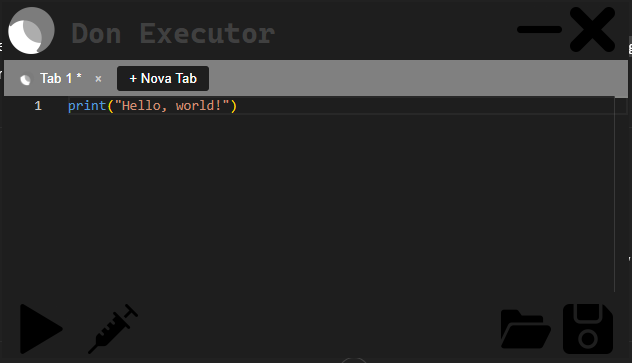
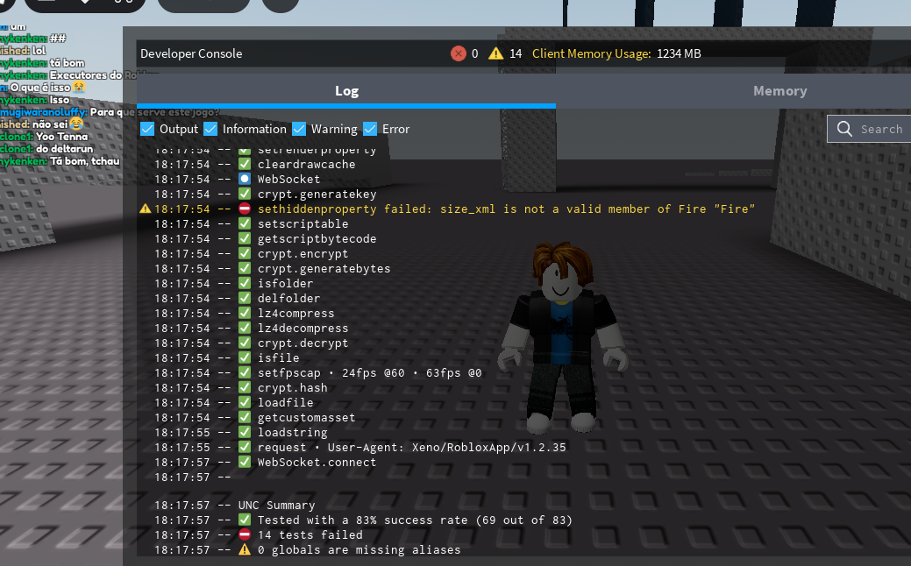

# Don Executor

## 🚀 Sobre

**Don Executor** é um executor de scripts robusto e moderno para Roblox, projetado para facilitar a vida dos desenvolvedores e entusiastas de scripts. Com uma interface elegante, integração com o Monaco Editor e uma API poderosa (`Don.api`), ele oferece alta compatibilidade (83% UNC) e performance confiável.

---

## 📊 Visualização da UNC

Confira abaixo a demonstração da UNC (Universal Script Compatibility), que garante execução eficiente dos scripts no Roblox.

---

## 🔧 Funcionalidades

- Interface intuitiva com Monaco Editor integrado  
- API `Don.api` para fácil integração em projetos Windows Forms  
- Compatibilidade elevada com scripts modernos no Roblox (83% UNC)  
- Sistema de tabs e editor com auto complete  
- Fácil de usar, com botões para injeção e execução rápidos

---

## 📥 Download & Website

Acesse o site oficial para baixar o executor e conferir o tutorial completo:

---

## 📄 Como usar

1. Baixe e adicione a DLL `Don.api` no seu projeto Visual Studio.  
2. Crie botões para injeção e execução do script.  
3. Use os métodos `Don.Class1.Modules.Inject()` e `Don.Class1.Modules.ExecuteScript(codigo)` para controlar o executor.

---

## 📝 Licença

Este projeto é open source e mantido com carinho para a comunidade Roblox.  

---

*Don Executor © 2025*
